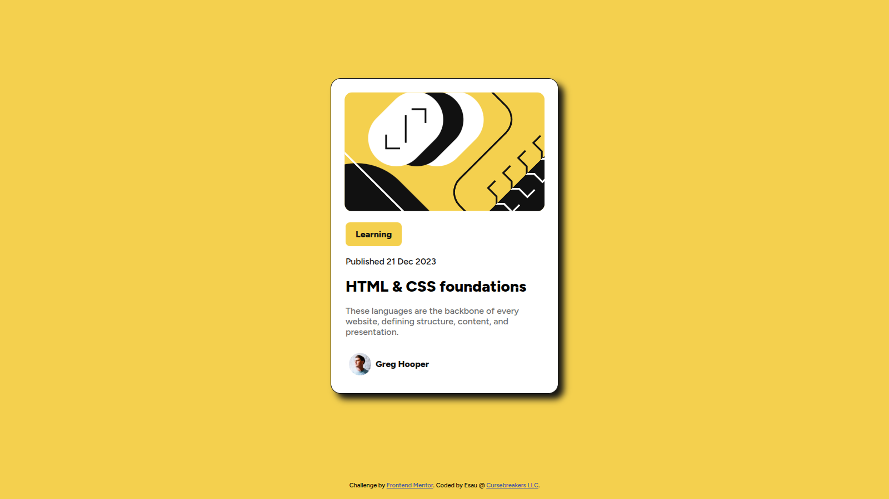
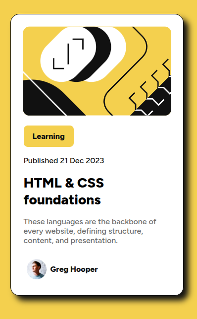

# Frontend Mentor - Blog Preview Card

This is a solution to the [Blog preview card challenge on Frontend Mentor](https://www.frontendmentor.io/challenges/blog-preview-card-ckPaj01IcS). Frontend Mentor challenges help you improve your coding skills by building realistic projects. 

## Table of contents

- [Overview](#overview)
  - [Screenshot](#screenshot)
  - [Links](#links)
- [My process](#my-process)
  - [Built with](#built-with)
- [Author](#author)

## Overview

### Screenshots

### Links

- Solution URL: [On GitHub](https://github.com/cursebreakers/blog-card)
- Live Site URL: [On GitHub Pages](https://cursebreakers.github.io/blog-card)

## Process

### Built with

- Semantic HTML5 markup
- CSS custom properties
- Flexbox
- Mobile-first workflow

## Author

- Website - Esau @ [Cursebreakers LLC](https://www.your-site.com)
- Frontend Mentor - [@cursebreakers](https://www.frontendmentor.io/profile/cursebreakers)

